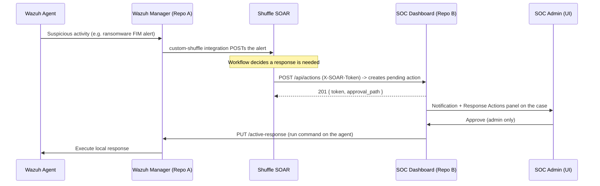

# SOAR Approval Workflow (Human-in-the-loop Active Response)

This runbook describes the approval loop that sits between Wazuh, Shuffle SOAR,
and the SOC Dashboard (Repo B). It lets an analyst approve or reject a
destructive response (host isolation, process kill, IP block) before it runs,
removing the risk of acting on a false positive.

## Flow



## API contract (Repo B)

All paths are under the dashboard backend (`/api/actions`).

| Method | Path | Auth | Purpose |
| --- | --- | --- | --- |
| POST | `/api/actions` | `X-SOAR-Token` header | SOAR creates a pending action |
| GET | `/api/actions?case_id=&status=` | analyst/admin JWT | List actions |
| GET | `/api/actions/{token}` | analyst/admin JWT | Get one action |
| POST | `/api/actions/{token}/approve` | **admin** JWT | Approve + dispatch to Wazuh |
| POST | `/api/actions/{token}/reject` | **admin** JWT | Reject (no dispatch) |

### Create payload

```json
{
  "action_type": "isolate-host",       // or kill-process | block-ip-iptables
  "target_agent_id": "001",
  "arguments": ["1.2.3.4"],            // optional, passed to the AR command
  "reason": "Ransomware behaviour on host",
  "rule_id": "100010",
  "alert_id": "<wazuh alert id>",
  "case_id": 12                          // optional, links to a case
}
```

`action_type` is validated against an allow-list and mapped to the Wazuh
active-response command of the same name. On approval the dashboard calls
`PUT /active-response?agents_list=<target_agent_id>` on the Wazuh manager.
The result is stored on the action as `execution_status`
(`success` / `failed` / `skipped`) and `execution_detail`.

## Setup

1. **Repo B `.env`**
   - `SOAR_WEBHOOK_TOKEN` — shared secret for the intake endpoint (empty = 503).
   - `WAZUH_API_BASE_URL`, `WAZUH_API_USERNAME`, `WAZUH_API_PASSWORD` — used to
     dispatch the approved response. If `WAZUH_API_PASSWORD` is empty the
     dispatch is `skipped` (the decision is still recorded).
   - Apply the migration: `docker compose exec soc-backend alembic upgrade head`.

2. **Repo A — let Wazuh forward alerts to Shuffle**
   Enable the `custom-shuffle` integration block in
   `soc-wazuh-config/wazuh/config/ossec.conf` and start Shuffle with the
   `soar` profile (`docker compose --profile soar up -d`), then restart the
   manager.

3. **Shuffle workflow**
   Import [`shuffle-soc-approval-workflow.json`](./shuffle-soc-approval-workflow.json)
   as a starting point and set the variables described below.

## Shuffle workflow

The reference workflow has two nodes:

1. **Webhook trigger** — receives the alert JSON from Wazuh's `custom-shuffle`
   integration.
2. **HTTP action** — `POST {DASHBOARD_URL}/api/actions` with header
   `X-SOAR-Token: {SOAR_WEBHOOK_TOKEN}` and a JSON body mapping alert fields to
   the create payload above.

Workflow variables to set in Shuffle:

| Variable | Example | Notes |
| --- | --- | --- |
| `DASHBOARD_URL` | `http://soc-backend:8000` | Reachable from the Shuffle backend |
| `SOAR_WEBHOOK_TOKEN` | matches Repo B `.env` | Sent as `X-SOAR-Token` |
| `ACTION_TYPE` | `isolate-host` | Choose per rule, or branch on `rule.id` |

Add conditions so only high-confidence, high-severity rules create an action
(e.g. ransomware rule `100010`), and keep the human approval as the only path
that actually dispatches the response.

## Security notes

- The intake endpoint compares the token with `hmac.compare_digest` and returns
  503 when no token is configured, so the loop is off by default.
- Approval and rejection require the **admin** role (superusers included);
  analysts can view but not dispatch.
- Every request/approve/reject writes an `audit_logs` entry
  (`action.requested` / `action.approved` / `action.rejected`).
- Approval records the decision even if the Wazuh dispatch fails, so a failed
  response is visible rather than silently lost.
